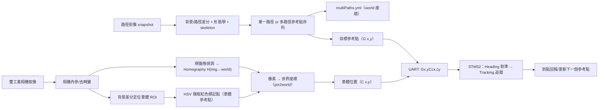

# 機於影像定位之無人載具導引控制設計｜STM32F103 + Linux(OpenCV) 視覺定位與參考路徑追蹤

本專案整合 **Linux 端的視覺定位/路徑萃取** 與 **STM32F103 端的差速車控制**，達成「在已知環境中找出參考路徑 → 串流取得車體位置 → MCU 以 Heading + Tracking 控制器追蹤參考點序列」的完整流程。控制器設計之模擬驗證請見Matlab_code中的檔案，其中readme.txt會說明個檔案之功用。

- **MCU (STM32F103)**：負責馬達 PWM、編碼器讀取、狀態機與控制器（Heading / Tracking PID）。
- **Linux (C++ / OpenCV)**：負責相機取像、棋盤格求單應性矩陣 `H`、背景差分定位車體標記點、萃取（單/多）參考路徑並串流透過 UART 給 MCU。

---

## 系統架構總覽



---

## 專案檔案（本次提供程式）

### STM32F103（控制/韌體核心）
- `main.c`  
  - 初始化時脈、PWM(TIM8)、控制迴圈(TIM6)、編碼器(TIM2/TIM3)、USART3 接收
  - 解析 UART 字串（格式見下方通訊協定）
  - 狀態機：`IDLE_FIRST -> HEADING -> TRACK -> IDLE`
- `controller.c / controller.h`  
  - 主要控制器：  
    - `heading_controller()`：先把車頭朝向目標點  
    - `input_output_PID_controller()`：以 tracking PI/PID 追蹤參考點
  - 內含角度 wrap、局部座標誤差 `(Pex, Pey)`、速度/角速度到輪速轉換等
- `type.c / type.h`  
  - 資料結構：`Motor`, `positionReceiver`, `stateKeeper`, `HeadingPI`, `TrackingPI`
  - 預設控制增益初始化（可依你的系統再調）
- `MotorDrive.c / MotorDrive.h`  
  - PWM 輸出與方向控制（實際上 `type.c` 也包含了 `driveMotor()`，兩者可能是不同版本/備份）

> ⚠️ 專案中還引用了其他 MCU 端檔案（如 `encoder.h`, `usart_3.h`, `clock.h` 等），此 README 以你提供的核心檔案為主做整合說明。

### Linux（視覺定位 / 路徑萃取 / 串流）
- `defRefPtStreamV3.cpp`（主程式）
  - 支援多種 terminal 指令模式：拍棋盤格、拍背景、定義原點、找路徑、串流傳送
  - 以 UART(`/dev/ttyUSB0`) 與 STM32 溝通
  - 支援 **雙相機**：必要時可在 frame0 / frame1 中定位車體
- `DIP_FUN.cpp`（影像處理函式庫）
  - `undistortImage()`：去畸變
  - `computeHmatrix2()`：棋盤格求 `H(img->world)`
  - `computeBox()`：背景差分找出車體/標記所在 ROI
  - `extractReferencePoint()`：在 ROI 內以 HSV 擷取紅色標記點、回傳 `(cx, cy)`
  - `pix2world()`：像素點透過 `H` 投影到世界座標
  - 路徑萃取相關：差分、形態學、thinning/skeleton、分段取樣等
- `findMultiPath_FUN.cpp`（多參考路徑）
  - 針對「多條可行參考路徑」的情境：找端點、排序、生成多條 path
  - 會把結果轉換成 world 座標並輸出到 `multiPaths.yml`
  - `loadMultiPaths(pts, path_idx)`：讀取 `multiPaths.yml` 中指定 `path_{idx}`

---

## 通訊協定（Linux ↔ STM32）

### Linux → STM32：目標點 + 車體位置
Linux 端會組合字串傳給 MCU（見 `defRefPtStreamV3.cpp`）：

- **格式**
  - `G{gx},{gy}C{cx},{cy}`
- **範例**
  - `G0.30,0.15C0.12,0.08`

其中：
- `Gx,y`：目前要追蹤的 **參考點**（world 座標，公尺）
- `Cx,y`：視覺估測到的 **車體位置**（world 座標，公尺）

STM32 端在 `main.c` 以：
```c
sscanf(line,"G%f,%fC%f,%f",&gx,&gy,&cx,&cy)
```
解析並更新 `ground` 與 `car` 的位置。

### STM32 → Linux：請求/更新（串流模式）
`stream_mode()` 會監聽 serial input，若收到：
- `REQ`：Linux 端回傳一次 `G...C...`（通常用於「車端請求最新位置/目標」）
- `UPDATE`：Linux 端將目標點 index +1，並回傳新的 `G...C...`

> ⚠️ 你提供的 `main.c` 在到點後會送出 `0x65 ('e') + '\n'`，而 Linux 端目前比對字串 `"UPDATE"`。  
> 若你的實際韌體/上位機已同步好協定可忽略；否則你需要 **擇一調整**：  
> 1) MCU 改送 `"UPDATE\n"`；或 2) Linux 端把 `"UPDATE"` 改成接收 `'e'`（或你定義的 token）。

---

## 世界座標與單應性矩陣 `H`

### 1) 棋盤格求 `H(img -> world)`
在 `DIP_FUN.cpp`：
- 棋盤格大小：`Size(8,5)`
- 方格邊長：`0.03 m`
- `findHomography(corners, world_pts, RANSAC, ...)` 得到 `H_img2w`

輸出到：
- `homography_from_chessboard.yml`（camera0）
- `homography_from_chessboard1.yml`（camera1）

### 2) 重新定義「參考座標原點」
`defineNewHmatrix2()` / `defineNewHmatrix_for_second_camera()` 會：
1. 讀取 `background*.jpg` 與 `origin*.jpg`（或 `originOnCar*.jpg`）
2. 背景差分得到 ROI
3. HSV 擷取紅色標記點 `(u0,v0)`（車體原點/起始位置）
4. 以 `(u0,v0)` 將 world 座標平移，使起始位置變成新的 (0,0)
5. 輸出到：
   - `H_matrix_new.yml`（camera0）
   - `H_matrix_new1.yml`（camera1）

---

## 參考路徑（單一路徑 / 多路徑）

### 多路徑輸出：`multiPaths.yml`
在 `findReferencePath_Multi()` 中會：
- 由 `background0.jpg` 與 `path0.jpg`（或兩相機）做差分
- 擷取路徑輪廓/中心線
- 找起點與多個出口（entry/exit）
- 生成多條 `referencePaths`
- 透過 `H_matrix_new.yml` 的 `H_new` 把像素點轉成 world 座標並輸出：
  - `multiPaths.yml`，key 為 `path_0`, `path_1`, ...

串流模式會用：
- `loadMultiPaths(refPoints2, path_idx)` 載入指定路徑序列
- 在每次 `"UPDATE"` 時把下一個目標點送給 MCU

---

## Linux 端指令模式（defRefPtStreamV3）

> 程式入口：`defRefPtStreamV3.cpp` 的 `main(argc, argv)`  
> 若 `argc==1` 會直接報錯（需要至少一個指令）。

### 常用流程（建議順序）
1) **拍棋盤格並計算 Homography**
- camera0：
  ```bash
  ./defRefPtStreamV3 chessboard
  ```
- camera1：
  ```bash
  ./defRefPtStreamV3 second_chessboard
  ```

2) **拍背景**
```bash
./defRefPtStreamV3 background
```

3) **定義原點（拍 origin 並建立 H_matrix_new）**
- camera0：
  ```bash
  ./defRefPtStreamV3 origin
  ```
- camera1：
  ```bash
  ./defRefPtStreamV3 second_origin
  ```

4) **拍路徑影像 + 找路徑（輸出 multiPaths.yml）**
```bash
./defRefPtStreamV3 findPath <segmentation>
# e.g.
./defRefPtStreamV3 findPath 10
```

5) **串流模式：選擇第幾條路徑**
```bash
./defRefPtStreamV3 stream <path_idx>
# e.g. 選 path_1
./defRefPtStreamV3 stream 1
```

### On-Car 版本（棋盤格/原點在車上）
- camera0：
  ```bash
  ./defRefPtStreamV3 chessboardOnCar
  ./defRefPtStreamV3 originOnCar
  ```
- camera1：
  ```bash
  ./defRefPtStreamV3 second_chessboardOnCar
  ./defRefPtStreamV3 second_originOnCar
  ```

---

## STM32 控制流程（韌體重點）

### 控制迴圈與狀態機
- `TIM6` 以 `fs=100`（0.01s）觸發採樣旗標 `sample=1`
- `main()` 迴圈中：
  1. 解析 UART line，更新 `ground(x,y)` / `car(x,y)`
  2. 若目標點改變 → 進入 `HEADING`
  3. `HEADING`：`heading_controller()` 對準目標方位角
  4. `TRACK`：`input_output_PID_controller()` 追蹤到目標點半徑 `rho_in`（預設 `0.03m`）
  5. 到點 → 停車、回報上位機、切回 IDLE 等待下一點

### 馬達與感測
- `TIM8` PWM（`pwm_Init(800,0)`，若 SYSCLK=8MHz 則約 10kHz）
- 編碼器：`TIM2/TIM3`（實作在你未提供的 `encoder.h` 模組）
- 方向腳位：
  - `PB0` / `PC4` 控制兩側馬達方向（見 `driveMotor()`）

---

## 依賴與環境

### Linux
- C++17（建議）
- OpenCV（程式 include `opencv2/opencv.hpp`）
- 工業相機 SDK（程式 include `CameraApi.h`；需安裝對應廠商 SDK 並正確連結）
- 串列通訊：`termios`（/dev/ttyUSB0）

### STM32F103
- STM32 Standard Peripheral Library（程式 include `stm32f10x.h`）
- 專案需包含你自定義的外設模組：encoder/usart/clock/gpio 等

---

## 重要輸出檔案（會在執行過程自動生成）

- `chessboard0.jpg`, `chessboard1.jpg`
- `background0.jpg`, `background1.jpg`
- `origin0.jpg`, `origin1.jpg`, `originOnCar0.jpg`, `originOnCar1.jpg`
- `homography_from_chessboard.yml`, `homography_from_chessboard1.yml`
- `H_matrix_new.yml`, `H_matrix_new1.yml`
- `path0.jpg`, `path1.jpg`
- `multiPaths.yml`（多路徑的 world 座標參考點）
- `recordCar.yml`（記錄車體位置軌跡）

---

## 常見問題與除錯建議

1) **找不到棋盤格角點**
- 確保棋盤格規格與程式一致：`8x5`、方格 `0.03m`
- 光照要均勻、避免反光
- 影像去畸變參數 `paramsFromMatlab*.yml` 必須存在且正確

2) **車體定位失敗（computeBox / extractReferencePoint fail）**
- 背景圖 `background*.jpg` 必須是「沒有車」的乾淨背景
- 車體標記顏色目前以 **紅色 HSV 閾值**為主（在 `extractReferencePoint()`）
  - 若你的標記顏色或光照不同，請調整 HSV threshold 與形態學參數

3) **Linux 串口權限**
```bash
sudo usermod -aG dialout $USER
# 重新登入後生效
```

4) **UART 協定對不上（REQ/UPDATE）**
- 依前述「通訊協定」段落，把 MCU 與 Linux 的觸發字串統一即可

---

## License
此專案可依你的需求加入授權條款（例如 MIT / BSD / GPL）。若你要投稿論文/論文附錄，也建議補上：
- 作者/指導教授資訊
- 引用格式（CITATION.cff）

---

## 致謝
- OpenCV 社群
- 工業相機 SDK 供應商
- 以及你的論文/實驗場域資源支持
